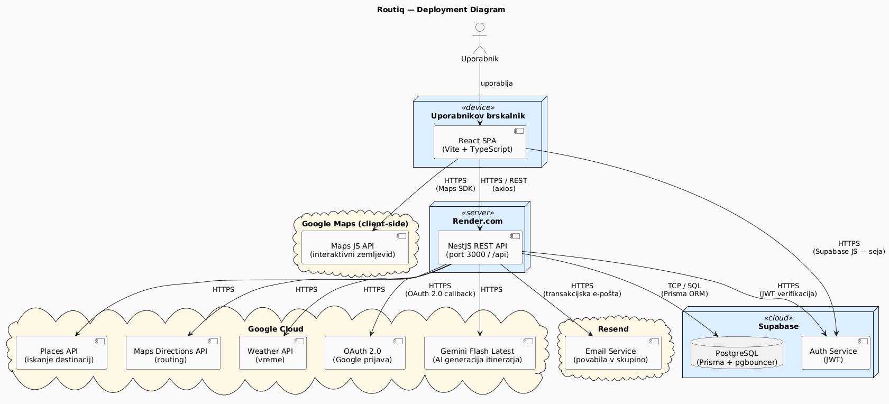
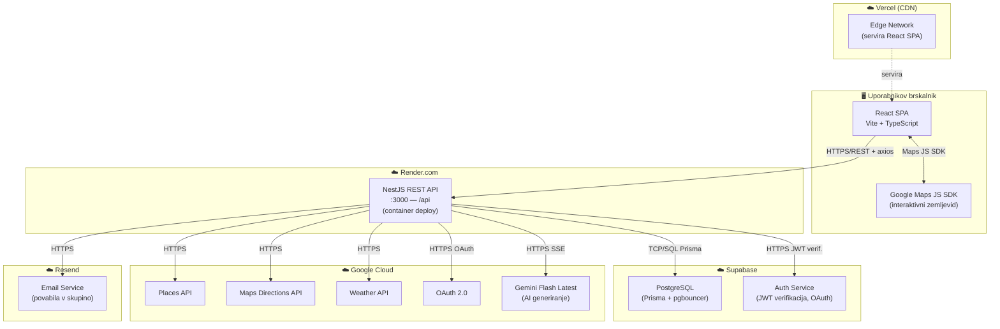
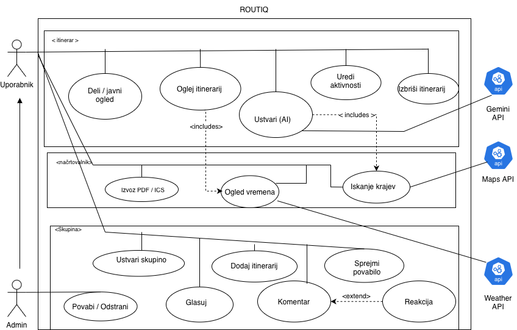
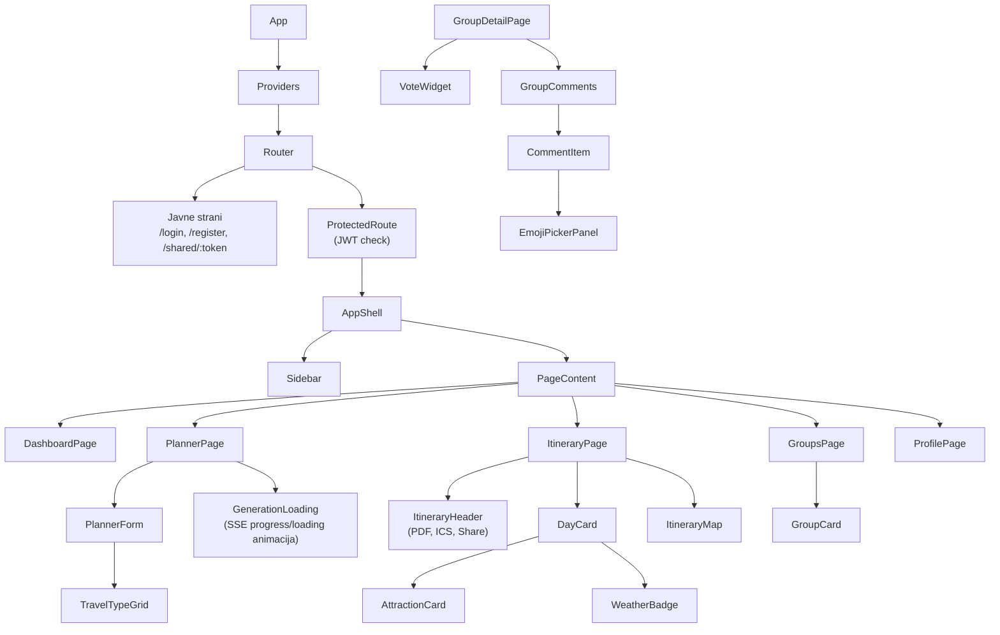
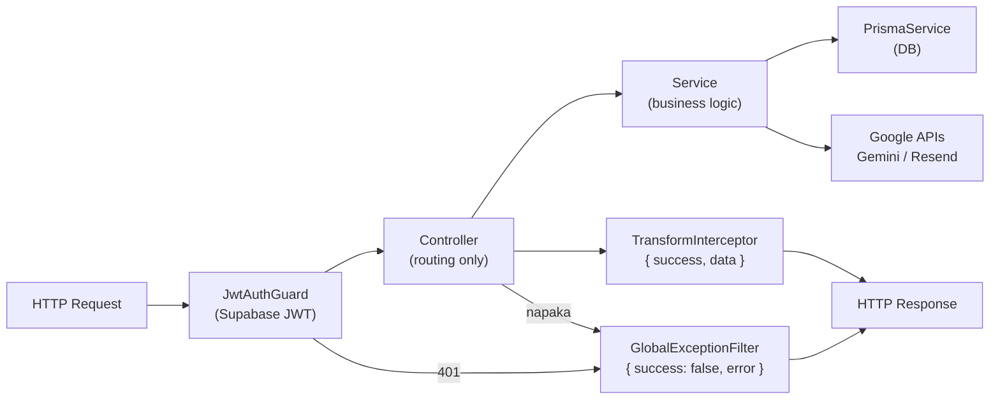

# Arhitektura sistema — Routiq

← [Nazaj na README](../README.md)

---

## Kazalo

1. [Deployment diagram](#1-deployment-diagram)
2. [Use Case diagram](#2-use-case-diagram)
3. [Tech stack](#3-tech-stack)
4. [Frontend arhitektura](#4-frontend-arhitektura)
5. [Backend arhitektura](#5-backend-arhitektura)
6. [Komunikacija med plastmi](#6-komunikacija-med-plastmi)

---

## 1. Deployment diagram

Sistem sestavljajo tri ločene plasti: **brskalnik** (React SPA), **strežnik** (NestJS na Render.com) in **oblačne storitve** (Supabase, Google Cloud, Resend, Vercel).





**Zakaj tak razpored?**

- Vse občutljive API klice dela **backend** — ključi (Gemini, Places, Weather, Resend) nikoli ne zapustijo strežnika
- **Frontend** kliče samo backend REST API in Google Maps JS SDK (ki zahteva klientski ključ, omejen samo na Maps Display)
- **Supabase** opravlja dvojno vlogo: PostgreSQL baza + JWT verifikacija (ni ločenega auth strežnika)

---

## 2. Use Case diagram

Pregled vseh funkcionalnosti sistema — kaj uporabnik in admin skupin lahko počneta.



---

## 3. Tech stack

### Frontend

| Kategorija | Tehnologija | Razlog izbire |
|---|---|---|
| Framework | React 18 + TypeScript | Stabilnost, komponente, JSX, obsežen ekosistem |
| Build tool | Vite | HMR < 1s, `strictPort: true` za predvidljive porte |
| Routing | React Router v6 | Standard za React SPA, nested routes |
| Styling | Tailwind CSS | Utility-first, konsistentna barvna paleta v `tailwind.config.ts` |
| HTTP client | **Axios 1.14.0 (pinana!)** | Interceptorji za Bearer token; refresh skrbi Supabase SDK |
| Forme | React Hook Form + Zod | Type-safe validacija, minimalni re-renders |
| Server data | TanStack Query v5 | Cache, loading stanja, background refetch |
| Datum/čas | date-fns | Tree-shakeable, immutable operacije |
| Karte | `@react-google-maps/api` | React wrapper za Google Maps JS SDK |
| PDF | `@react-pdf/renderer` | Klientsko generiranje PDF brez strežniškega klica |
| Animacije | Framer Motion | Itinerar prehodi, loading stanja |
| Ikone | Lucide React | Konsistentna SVG ikona knjižnica |

### Backend

| Kategorija | Tehnologija | Razlog izbire |
|---|---|---|
| Framework | NestJS 10 + TypeScript | Modularnost, DI container, dekoratorji, Swagger |
| Runtime | Node.js >= 20 LTS | LTS stabilnost |
| ORM | Prisma | Type-safe DB klici, migrations, studio |
| Baza | PostgreSQL 15 (Supabase) | Hosted, pgbouncer za connection pooling |
| Auth | Supabase Auth | JWT verifikacija, Google OAuth, session management |
| AI | Google Gemini 2.5 Flash | SSE streaming, nizka latenca za streaming |
| Validacija | class-validator + class-transformer | Dekoratorji na DTO razredih |
| Varnost | Helmet | HTTP security headers (CSP, HSTS...) |
| E-pošta | Resend | Zanesljiva transakcijska e-pošta, preprosto SDK |
| HTTP | **Axios 1.14.0 (pinana!)** | Za klice na zunanje API-je |
| Swagger | `@nestjs/swagger` | Auto-generirana API dokumentacija |

> ⚠️ **Axios opomba:** Verziji `1.14.1` in `0.30.4` sta bili marca 2026 kompromitirani. Glej [Izzivi in rešitve](challenges.md#supply-chain-napad-na-axios).

---

## 3. Frontend arhitektura

### 3.1 Struktura map

```
frontend/src/
├── app/
│   ├── App.tsx             # Root komponenta, ovija Providers + Router
│   ├── Providers.tsx       # QueryClient, AuthContext, GoogleMapsProvider, Toaster
│   └── router.tsx          # Vse rute z React Router v6 (lazy loading)
│
├── api/                    # Vsi HTTP klici — komponente NIKOLI ne kličejo axios direktno
│   ├── axios.ts            # Instanca + request/response interceptorji
│   ├── auth.api.ts
│   ├── itinerary.api.ts
│   ├── attractions.api.ts
│   ├── weather.api.ts
│   ├── groups.api.ts
│   ├── notifications.api.ts
│   ├── profile.api.ts
│   ├── supabase.ts
│   └── export.api.ts
│
├── components/
│   ├── ui/                 # Primitivi: Button, Input, Modal, Toast, Badge, Skeleton...
│   │                       # Brez poslovne logike — samo props → UI
│   └── layout/             # AppShell, Sidebar, Topbar, ProtectedRoute, ErrorBoundary
│
├── features/               # Feature-based organizacija
│   ├── auth/               # Login, Register, Google OAuth gumb (useAuth v app/Providers.tsx)
│   ├── planner/            # Večstopenjski form, TravelTypeGrid, SSE streaming prikaz
│   ├── itinerary/          # Prikaz, urejanje (drag&drop), ItineraryMap, WeatherBadge
│   ├── dashboard/          # Seznam shranjenih potovanj
│   ├── groups/             # Skupinska potovanja, NotificationsPage, VoteWidget, komentarji
│   ├── landing/            # Javna landing stran
│   ├── help/               # Pomoč in FAQ
│   └── profile/            # Profil, avatar upload, nastavitve
│
├── hooks/                  # Deljeni custom hooks (useDebounce, useStream, useMediaQuery...)
├── types/                  # TypeScript tipi za vse domenske entitete
├── utils/                  # Pure utility funkcije (date, format, map, validation)
└── constants/              # ROUTES, QUERY_KEYS, travelTypes enum
```

### 3.2 Feature modul — struktura

Vsak feature (planner, itinerary, groups...) ima enako interno strukturo:

```
features/<ime>/
├── pages/          # Strani ki jih router direktno naloži
├── components/     # Komponente specifične za ta feature (ne reusamo drugje)
└── hooks/          # Custom hooks za data fetching in lokalno logiko
```

**Pravilo reusability:** Komponenta ki se pojavi na dveh ali več mestih → v `components/`. Samo en feature → v `features/<feature>/components/`.

### 3.3 State management

| Vrsta stanja | Orodje | Primer |
|---|---|---|
| Podatki s serverja | TanStack Query | Itinerarji, skupin, profil — cache + background refetch |
| Globalni UI state | React Context | Auth user objekt, tema |
| Lokalni state | `useState` | Modal open/close, wizard korak, form polje |
| Forme | React Hook Form + Zod | Vsi formularji z validacijo |
| AI streaming | `useState` + `useStream` hook | Dogodki o napredku za loading animacijo |

### 3.4 Routing

Vse rute so definirane v `src/app/router.tsx`. Poti so konstante v `src/constants/routes.ts` — nikoli ne pišemo path stringov direktno v komponente:

```typescript
export const ROUTES = {
  HOME: '/',
  DASHBOARD: '/dashboard',
  PLANNER: '/planner',
  ITINERARY: (id: string) => `/itinerary/${id}`,
  GROUPS: '/groups',
  GROUP_DETAIL: (id: string) => `/groups/${id}`,
  ...
} as const
```

Zaščitene strani so zavite v `<ProtectedRoute>` ki ob neautenticiranem dostopu preusmeri na `/login?redirect=<original-path>`.

### 3.5 Hierarhija komponent



---

## 4. Backend arhitektura

### 4.1 NestJS koncepti

NestJS sili v modularno arhitekturo z jasno ločitvijo odgovornosti:



| NestJS koncept | Naloga | Primer |
|---|---|---|
| **Module** | Enkapsulira feature — controller + service + uvozi | `ItineraryModule`, `GroupsModule` |
| **Controller** | HTTP routing — URL + metoda + params. **Brez logike.** | `@Get(':id') findOne(@Param('id') id)` |
| **Service** | Vsa poslovna logika + DB klici + zunanji API-ji | `generateStream()`, `inviteMember()` |
| **DTO** | Validacija incoming requestov z `class-validator` | `CreateGroupDto`, `CreateItineraryDto` |
| **Guard** | Odloči ali je request dovoljen | `JwtAuthGuard` (globalen), `RolesGuard` |
| **Interceptor** | Ovije response v enotni format | `TransformInterceptor`, `LoggingInterceptor` |
| **Filter** | Ujame vse napake, vrne konzistenten error format | `GlobalExceptionFilter` |
| **Decorator** | Označuje endpointe ali pridobi podatke | `@Public()`, `@CurrentUser()` |

### 4.2 Struktura modulov

```
backend/src/
├── main.ts             # Bootstrap: CORS, Helmet, ValidationPipe, Swagger, Cookie parser
├── app.module.ts       # Root modul — uvozi vse feature module
│
├── config/             # @nestjs/config — type-safe env dostop
├── prisma/             # PrismaService singleton (connect ob startu)
├── supabase/           # SupabaseService (JWT verifikacija, admin klici)
│
├── common/
│   ├── decorators/     # @CurrentUser() → pridobi user iz JWT, @Public() → bypass auth
│   ├── filters/        # AllExceptionsFilter → { success: false, error: { code, message } }
│   ├── guards/         # JwtAuthGuard (globalen), RolesGuard (skupin vloge)
│   ├── interceptors/   # TransformInterceptor, LoggingInterceptor
│   └── utils/
│       └── retry.util.ts   # withRetry() — exponential backoff z jitter
│
├── auth/               # Placeholder modul (avtentikacija je v Supabase)
├── users/              # GET/PATCH profil, avatar upload, nastavitve, DELETE account
├── itinerary/          # POST /generate (SSE), CRUD, share token, aktivnosti
│   └── prompts/        # buildItineraryPrompt() — sestavi Gemini prompt
├── gemini/             # GeminiService.streamGenerate() — SSE iz Gemini API
├── attractions/        # GET /search, GET /alternatives (Google Places proxy)
├── weather/            # GET /weather — napoved z 1h memory cache
├── groups/             # CRUD skupin, invite/accept/decline, glasovanje, komentarji
├── notifications/      # GET/PATCH obvestila — in-app notifikacije (vote, invite, komentar)
├── export/             # GET /export/:id/ics — generiranje .ics datoteke
├── mail/               # sendInvitation() — Resend e-pošta
└── health/             # GET /health — Render health check
```

### 4.3 Odgovornosti po modulu

| Modul | Controller skrbi za | Service skrbi za |
|---|---|---|
| `users` | GET/PATCH `/users/profile`, POST `/avatar`, GET/PATCH `/settings`, DELETE `/account` | findById, updateProfile, uploadAvatarFile, updateSettings, deleteAccount |
| `itinerary` | POST `/generate` (SSE), GET/PATCH/DELETE `/:id`, POST `/:id/share`, GET `/shared/:token`, CRUD aktivnosti | AI orchestracija, CRUD, share token, ownership preverjanje |
| `gemini` | — (interno) | `streamGenerate()` — pošlje prompt, vrne Observable SSE chunkov |
| `attractions` | GET `/search`, GET `/:id`, POST `/:id/alternatives` | Google Places API proxy |
| `weather` | GET `/weather?destination&startDate&days` | `getForecast()` + 1h memory cache |
| `groups` | CRUD skupin, invite, accept/decline, remove, roles, itinerarji, vote (+ remove vote), comments, activity log | Permission hierarhija (OWNER>ADMIN>MODERATOR>MEMBER), transakcije, ActivityLog |
| `notifications` | GET `/notifications`, unread-count, read, read-all | In-app obvestila; fire-and-forget iz groups service (vote, invite) |
| `export` | GET `/export/:id/ics` | Generiranje .ics datoteke iz Prisma podatkov |
| `mail` | — (interno) | `sendInvitation()` prek Resend SDK |

### 4.4 Global setup (main.ts)

```typescript
// Varnostni headerji (Helmet)
app.use(helmet({ contentSecurityPolicy: { ... } }))

// Validacija vseh DTO-jev
app.useGlobalPipes(new ValidationPipe({
  whitelist: true,              // Odstrani neznana polja
  transform: true,              // Avtomatska type transformacija
  forbidNonWhitelisted: true,   // Vrže napako za neznana polja (ne samo ignorira)
}))

// Enotni response format
app.useGlobalInterceptors(new TransformInterceptor(), new LoggingInterceptor())

// Enotni error format
app.useGlobalFilters(new AllExceptionsFilter())

// API prefix
app.setGlobalPrefix('api')

// Swagger (samo v development)
// → http://localhost:3000/api/docs
```

---

## 5. Komunikacija med plastmi

### 5.1 Request lifecycle

```
Brskalnik
  → HTTPS request na Vercel/Render
  → CORS preverjanje (allowedOrigins lista)
  → Cookie parser (refresh token)
  → Helmet middleware (security headers)
  → JwtAuthGuard (Supabase JWT verifikacija)
  → ValidationPipe (DTO validacija)
  → Controller (routing)
  → Service (business logic)
  → PrismaService (DB)
  → TransformInterceptor (ovije v { success, data })
  → HTTPS response
```

### 5.2 Error handling

Vsaka napaka — ne glede na to kje nastane — gre skozi `AllExceptionsFilter`:

```json
{
  "success": false,
  "error": {
    "code": "ITINERARY_NOT_FOUND",
    "message": "Itinerary with id xyz not found",
    "statusCode": 404
  }
}
```

### 5.3 SSE streaming (AI generiranje)

SSE (Server-Sent Events) je enosmerna HTTP konekcija strežnik → klient. Pri generiranju itinerarja se prejeti podatki o napredku uporabijo za ažuriranje loading animacije, celoten itinerar pa se prikaže ob koncu ko je shranjen v bazi:

```
FE odpre SSE konekcijo → POST /api/itinerary/generate
  ← { type: 'status',      message: 'Pripravljam podatke...' }
  ← { type: 'attractions', data: [...] }
  ← { type: 'day',         data: { dayNumber: 1, activities: [...] } }
  ← { type: 'day',         data: { dayNumber: 2, activities: [...] } }
  ← { type: 'day',         data: { dayNumber: 3, activities: [...] } }
  ← { type: 'complete',    itineraryId: 'uuid' }  ← FE redirect na /itinerary/:id
konekcija se zapre
```

Podroben podatkovni tok: [Podatkovni tokovi](data-flows.md#ai-generiranje-itinerarja-sse-streaming)
