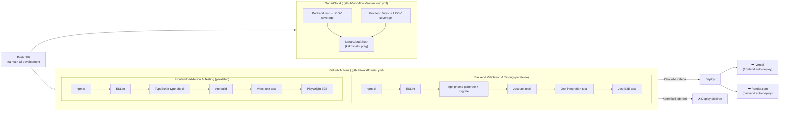

# CI/CD pipeline — Routiq

← [Nazaj na README](../README.md)

---

## Kazalo

1. [Pregled pipeline-a](#1-pregled-pipeline-a)
2. [GitHub Actions konfiguracija](#2-github-actions-konfiguracija)
3. [Backend validacija in testiranje](#3-backend-validacija-in-testiranje)
4. [Frontend validacija in testiranje](#4-frontend-validacija-in-testiranje)
5. [SonarCloud analiza kode](#5-sonarcloud-analiza-kode)
6. [Deploy — Vercel (frontend)](#6-deploy--vercel-frontend)
7. [Deploy — Render (backend)](#7-deploy--render-backend)
8. [Okolja (environments)](#8-okolja-environments)

---

## 1. Pregled pipeline-a



Pipeline se sproži ob:
- `push` na branch `main` ali `development`
- `pull_request` na branch `main` ali `development`

---

## 2. GitHub Actions konfiguracija

Datoteka: `.github/workflows/ci.yml`

```yaml
name: Routiq CI Pipeline

on:
  push:
    branches: [ main, development ]
  pull_request:
    branches: [ main, development ]

jobs:
  backend-checks:
    name: Backend Validation & Testing
    runs-on: ubuntu-latest
    # services: postgres:16 na portu 5433 (za integration + E2E teste)
    defaults:
      run:
        working-directory: ./backend
    steps:
      - uses: actions/checkout@v4
      - uses: actions/setup-node@v4
        with: { node-version: '20', cache: 'npm' }
      - run: npm ci
      - run: npm run lint
      - run: npx prisma generate && npx prisma migrate deploy
      - run: npm run test               # unit testi
      - run: npm run test:integration   # integration testi (prava DB)
      - run: npm run test:e2e           # E2E / regresijski testi

  frontend-checks:
    name: Frontend Validation & Testing
    runs-on: ubuntu-latest
    defaults:
      run:
        working-directory: ./frontend
    steps:
      - uses: actions/checkout@v4
      - uses: actions/setup-node@v4
        with: { node-version: '20', cache: 'npm' }
      - run: npm ci
      - run: npm run lint
      - run: npm run type-check
      - run: npm run build
      - run: npm run test:unit:run      # Vitest unit testi
      - run: npm run test:e2e           # Playwright E2E testi
```

Backend in frontend joba tečeta **vzporedno** — celoten CI se zaključi hitreje.

---

## 3. Backend validacija in testiranje

| Korak | Ukaz | Kaj preverja |
|---|---|---|
| Namestitev | `npm ci` | Deterministična namestitev iz `package-lock.json` |
| Linting | `npm run lint` (ESLint) | Koda sledi ESLint pravilom (`no-any`, naming...) |
| Prisma | `npx prisma generate + migrate deploy` | Shema je veljavna, migracije se aplicirajo |
| Unit testi | `npm run test` (Jest) | Izolirani unit testi z mock odvisnostmi |
| Integration testi | `npm run test:integration` | Testi z resnično PostgreSQL testno bazo |
| E2E / regresija | `npm run test:e2e` | Celoviti scenariji prek REST API |

**Zakaj `npm ci` namesto `npm install`?**
`npm ci` je deterministično — vedno namesti točno verzije iz `package-lock.json`. `npm install` bi lahko povlekel novo (potencialno kompromitirano) verzijo paketa.

**Testna baza za integration teste:**
CI zaganja PostgreSQL 16 v Docker kontejnerju na portu `5433`. `DATABASE_URL` kaže na to lokalno instanco. Integration testi tečejo s pravo bazo, enako kot produkcija.

---

## 4. Frontend validacija in testiranje

| Korak | Ukaz | Kaj preverja |
|---|---|---|
| Namestitev | `npm ci` | Deterministično |
| Linting | `npm run lint` | ESLint pravila |
| TypeScript | `npm run type-check` (`tsc --noEmit`) | TypeScript napake brez generiranja outputa |
| Build | `npm run build` (`vite build`) | Produkcijski build (ujame manjkajoče importe, type napake) |
| Unit testi | `npm run test:unit:run` (Vitest) | Komponente, hooks, utility funkcije |
| E2E testi | `npm run test:e2e` (Playwright) | Celoviti brskalniški scenariji |

**Zakaj `vite build` v CI?**
Produkcijski build je strožji od development — ujame manjkajoče module, TypeScript napake in prevelike chunke.

---

## 5. SonarCloud analiza kode

Datoteka: `.github/workflows/sonarcloud.yml`

SonarCloud teče **vzporedno** s CI pipeline-om — ne blokira deploya.

```yaml
on:
  push:
    branches: [main, development]
  pull_request:
    branches: [main, development]
```

**Koraki:**
1. Backend `jest --coverage` → generira `backend/coverage/lcov.info`
2. Frontend `vitest run --coverage` → generira `frontend/coverage/lcov.info`
3. Popravi poti za monorepo (`SF:src` → `SF:backend/src` / `SF:frontend/src`)
4. SonarCloud Scan z obema LCOV datotekama

**Kakovostni prag (Quality Gate):**
- Pokritost nove kode ≥ 80 %
- Nobenih novih blokerjev ali kritičnih napak

**Izključene datoteke iz pokritosti:**
```
backend/src/main.ts
backend/src/**/*.module.ts
backend/src/**/*.dto.ts
backend/src/config/**/*
backend/src/health/**/*
frontend/src/app/**/*
frontend/src/types/**/*
frontend/src/constants/**/*
```

Konfiguracija: `sonar-project.properties` v korenu repota.

---

## 6. Deploy — Vercel (frontend)

Vercel je konfiguriran za **auto-deploy** ob vsakem push na `main`.

**Konfiguracija** (`frontend/vercel.json`):
```json
{
  "cleanUrls": true,
  "rewrites": [
    { "source": "/(.*)", "destination": "/index.html" }
  ]
}
```

- `cleanUrls: true` — URL-ji brez `.html` končnice
- `rewrites` — SPA fallback: vse poti se preusmerijo na `index.html` (React Router prevzame routing)

**Zakaj je SPA rewrite potreben?**
React Router deluje na klientski strani. Ko uporabnik direktno odpre `https://routiq.app/itinerary/abc`, Vercel strežnik poskuša postreči `/itinerary/abc.html` ki ne obstaja — brez rewrite vrne 404. Z rewrite-om vedno vrne `index.html`, React Router pa potem navigira na pravo stran.

**Environment variables na Vercel:**
- `VITE_API_URL`
- `VITE_GOOGLE_MAPS_API_KEY`
- `VITE_SUPABASE_URL`
- `VITE_SUPABASE_ANON_KEY`

---

## 7. Deploy — Render (backend)

Render je konfiguriran za **auto-deploy** ob vsakem push na `main`.

**Tip servisa:** Web Service (container)

**Build command:**
```bash
cd backend && npm ci && npx prisma generate && npm run build
```

**Start command:**
```bash
cd backend && npm run start:prod
```

**Environment variables na Render:**
Vse iz `backend/.env.example` z dejanskimi vrednostmi (Supabase, Google APIs, Gemini, Resend...).

**Health check:**
Render periodično kliče `GET /api/health` — če endpoint ne odgovori, Render restart-a servis.

---

## 8. Okolja (environments)

| Okolje | Frontend | Backend | Baza |
|---|---|---|---|
| **Development** | `http://localhost:5173` | `http://localhost:3000` | Supabase dev projekt |
| **Production** | `https://routiq.vercel.app` | `https://routiq.onrender.com` | Supabase prod projekt |

**Branch strategija:**
- `development` → aktivni razvoj (CI teki, PR-ji)
- `main` → produkcija (Vercel + Render auto-deploy)

Merge v `main` se naredi samo ob stabilni iteraciji — po pregledu in testu na `development`.
