# Podatkovni tokovi — Routiq

← [Nazaj na README](../README.md)

Dokument opisuje ključne podatkovne tokove v sistemu z sequence in activity diagrami.

---

## Kazalo

1. [Avtentikacija — JWT tok](#1-avtentikacija--jwt-tok)
2. [Google OAuth tok](#2-google-oauth-tok)
3. [AI generiranje itinerarja (SSE streaming)](#3-ai-generiranje-itinerarja-sse-streaming)
4. [Urejanje aktivnosti v itinerariju](#4-urejanje-aktivnosti-v-itinerariju)
5. [Ustvari skupino](#5-ustvari-skupino)
6. [Povabi člana v skupino](#6-povabi-člana-v-skupino)
7. [Sprejmi / zavrni povabilo](#7-sprejmi--zavrni-povabilo)
8. [Dodaj itinerar v skupino + glasovanje](#8-dodaj-itinerar-v-skupino--glasovanje)
9. [Izvoz itinerarja](#9-izvoz-itinerarja)

---

## 1. Avtentikacija — JWT tok

Avtentikacija temelji na **Supabase Auth** — Supabase skrbi za JWT izdajanje in verifikacijo. Backend samo validira token prek Supabase Admin SDK.

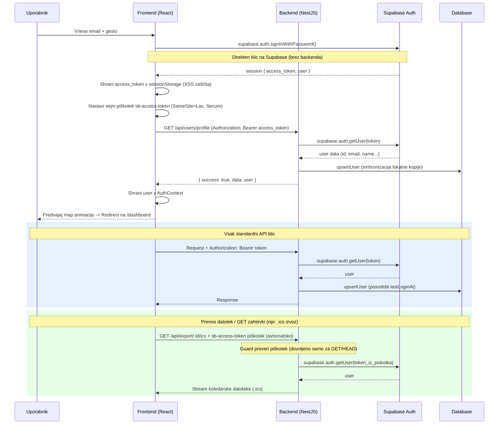

**Ključne varnostne odločitve:**
1. **sessionStorage**: Žetoni se namesto v `localStorage` shranjujejo v `sessionStorage`, kar preprečuje permanentno krajo žetonov (seja se uniči takoj ob zaprtju zavihka brskalnika).
2. **SameSite=Lax Sejni piškotek**: Sinhroniziran piškotek `sb-access-token` deluje kot varnostni fallback za zaščitene `GET` prenose. Nima nastavljenega roka trajanja (Expires), tako da ga brskalnik izbriše ob zaprtju seje.
3. **CSRF zaščita na backendu**: `JwtAuthGuard` prebere token iz piškotka **izključno pri varnih metodah (`GET`, `HEAD`, `OPTIONS`)**. Za vse ostale (POST, PUT, DELETE, PATCH) zahteva eksplicitno Bearer záhlavje, kar onemogoča CSRF napade.

---

## 2. Google OAuth tok

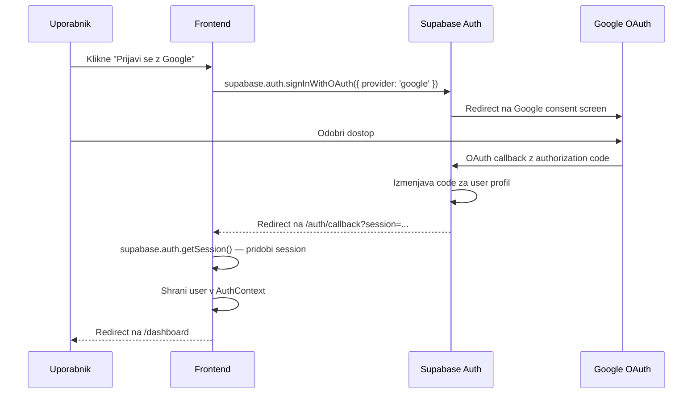

---

## 3. AI generiranje itinerarja (SSE streaming)

Generiranje poteka v treh fazah: **vzporedna priprava podatkov**, **Gemini SSE streaming** (vsak dan posebej), **Prisma transakcija** (shranjevanje).

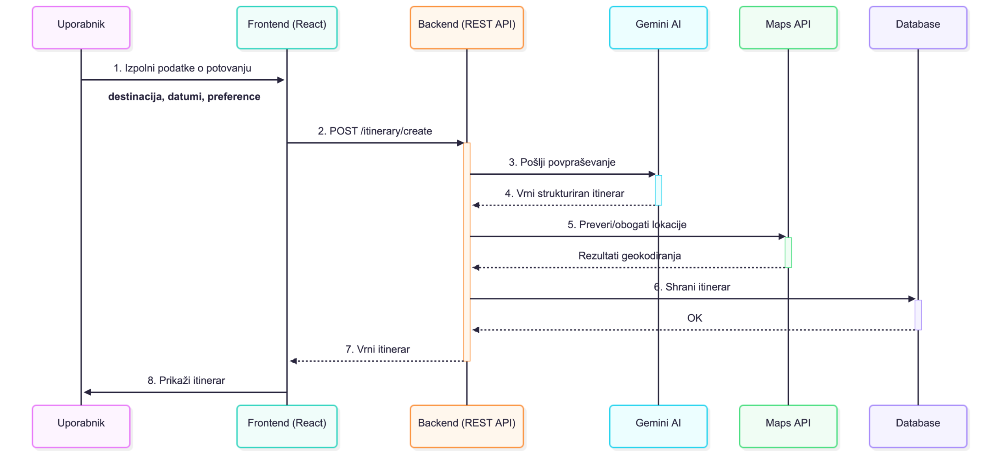

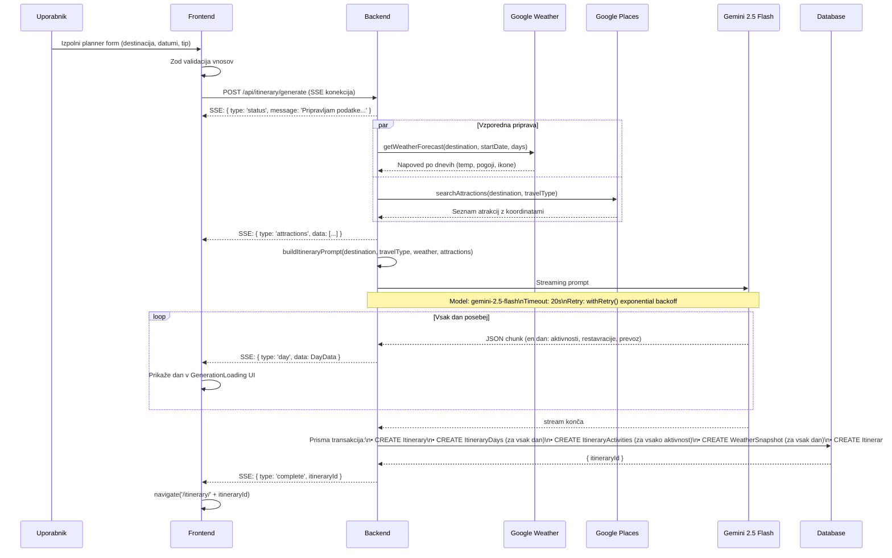

### Aktivnostni diagram generiranja

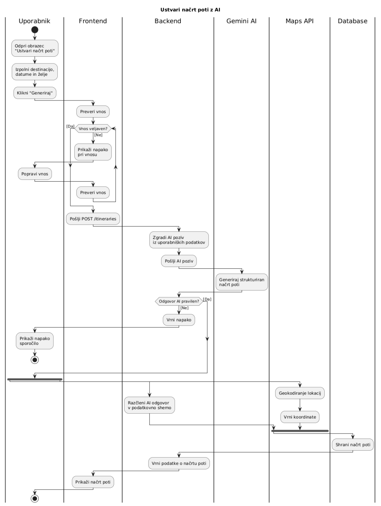

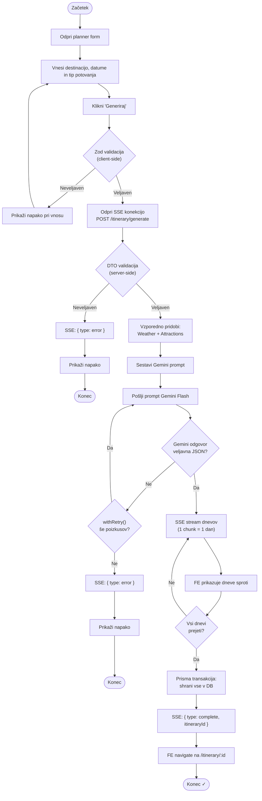

### Promptni inženiering

Prompt (`backend/src/itinerary/prompts/generate-itinerary.prompt.ts`) vsebuje:
- Destinacijo in tip potovanja
- Vremensko napoved za vsak dan (temperature, razmere)
- Seznam atrakcij iz Google Places (z ocenami, koordinatami)
- Navodilo za strukturiran JSON odgovor (specifična shema)
- Navodilo za vnos trajanja aktivnosti (za `durationMinutes`)

---

## 4. Urejanje aktivnosti v itinerariju

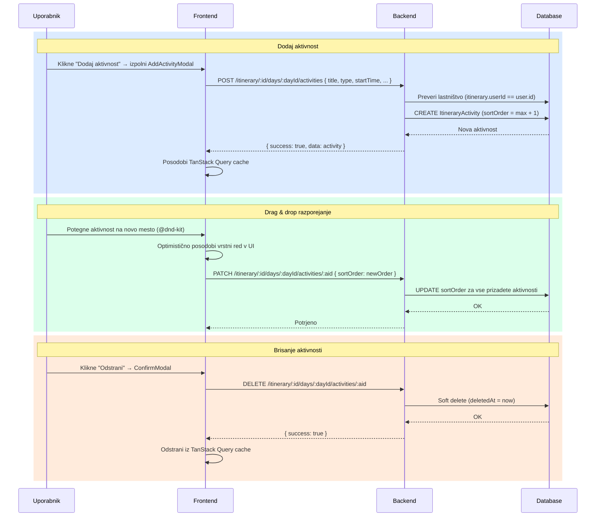

---

## 5. Ustvari skupino

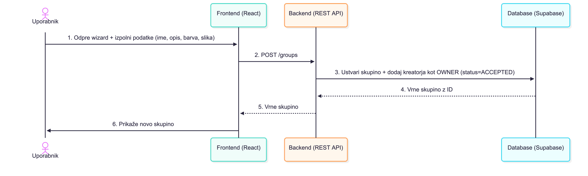

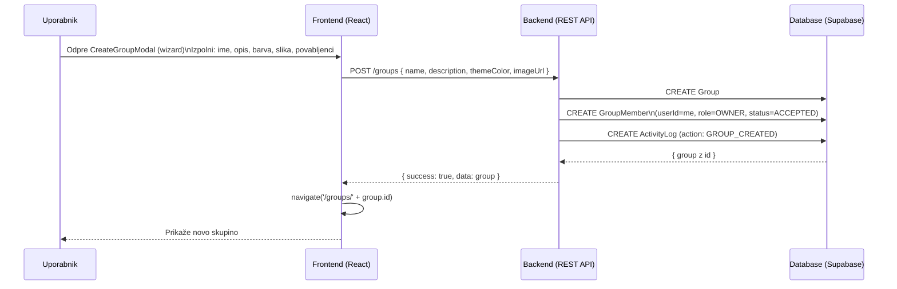

---

## 6. Povabi člana v skupino

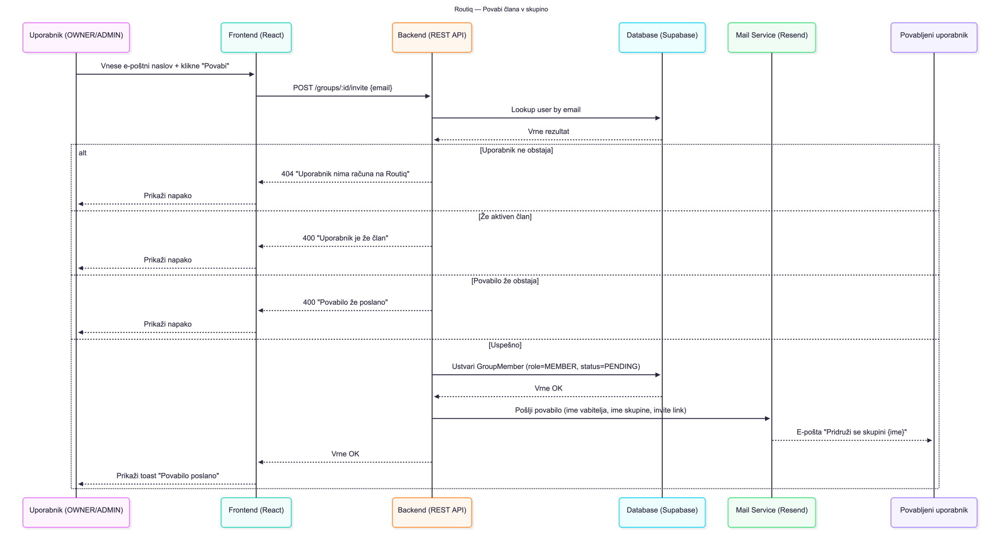

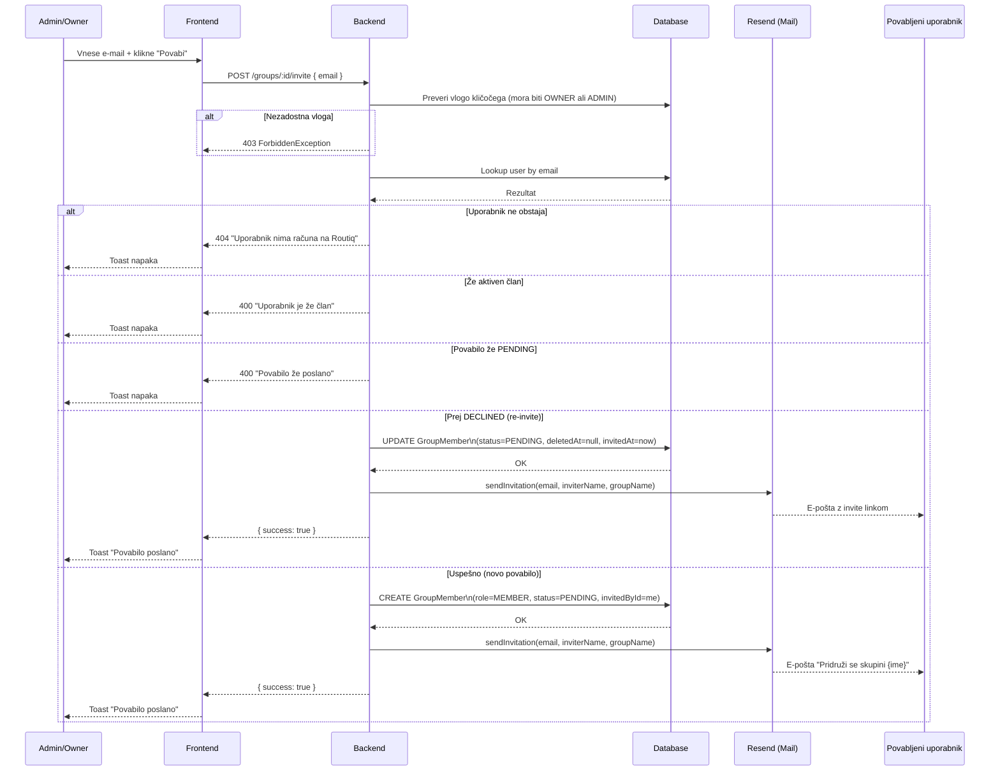

---

## 7. Sprejmi / zavrni povabilo

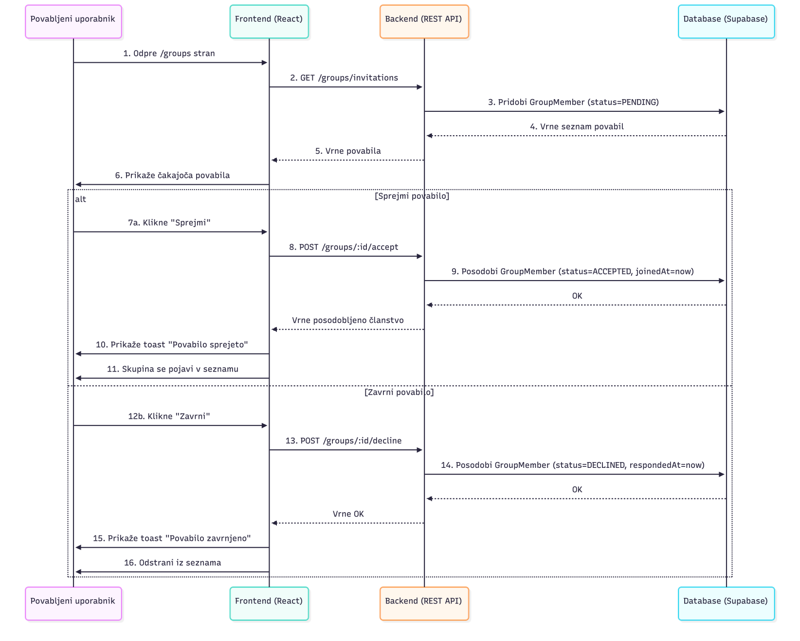

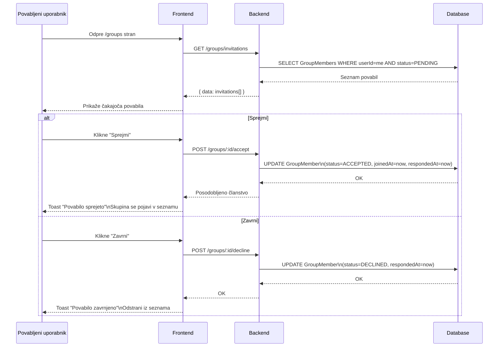

---

## 8. Dodaj itinerar v skupino + glasovanje

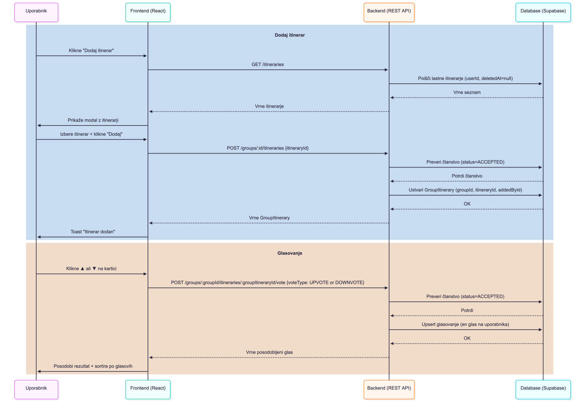

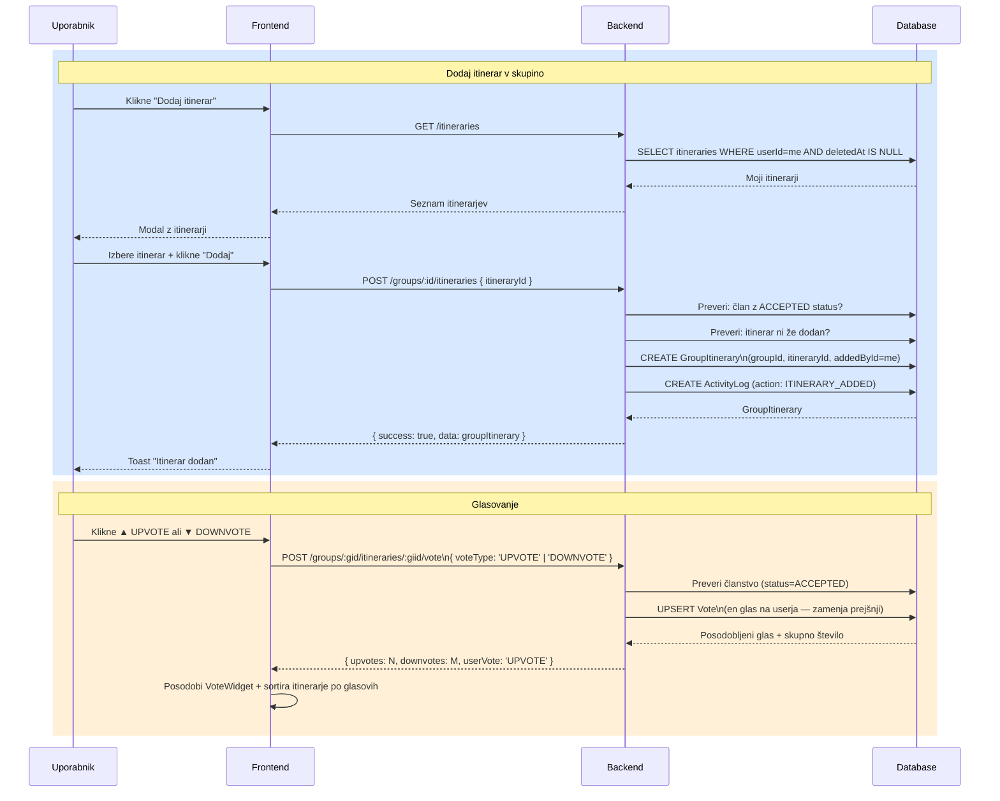

---

## 9. Izvoz itinerarja

### PDF izvoz (klient)

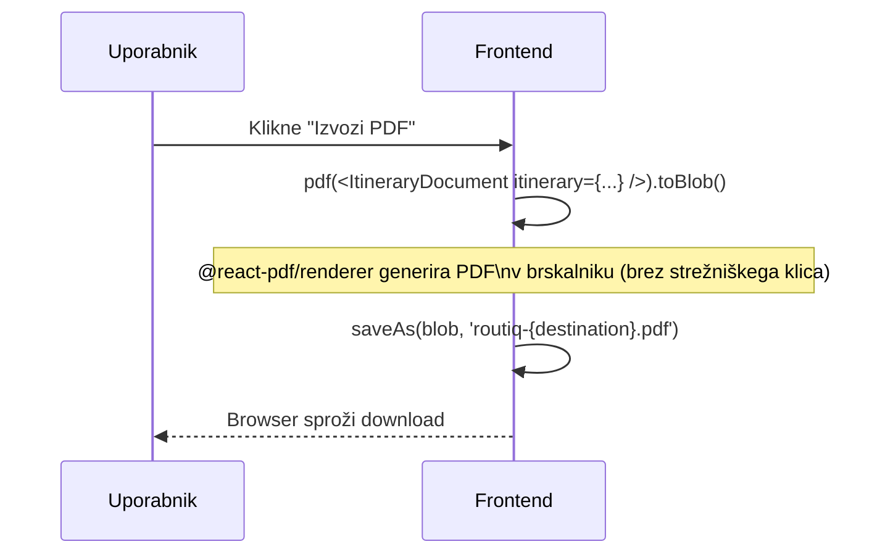

### ICS izvoz (strežnik)

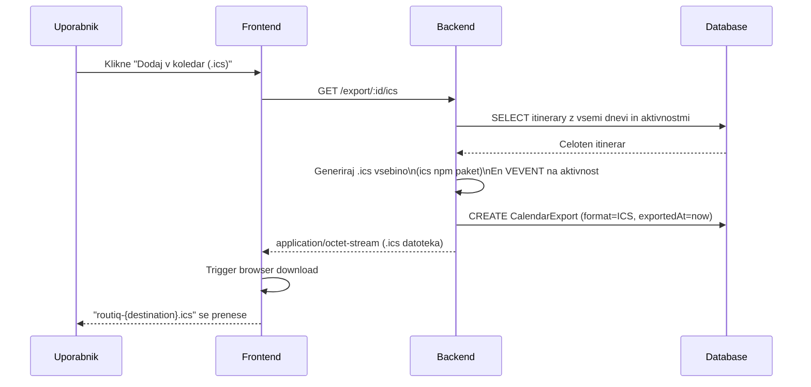
