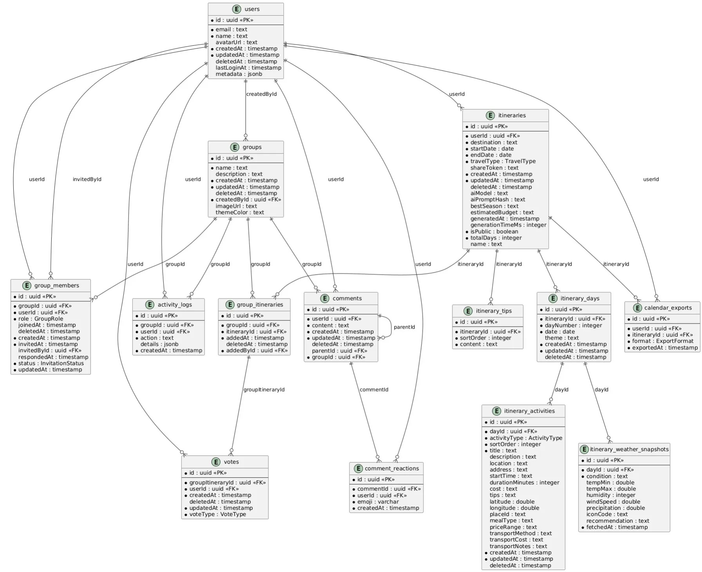
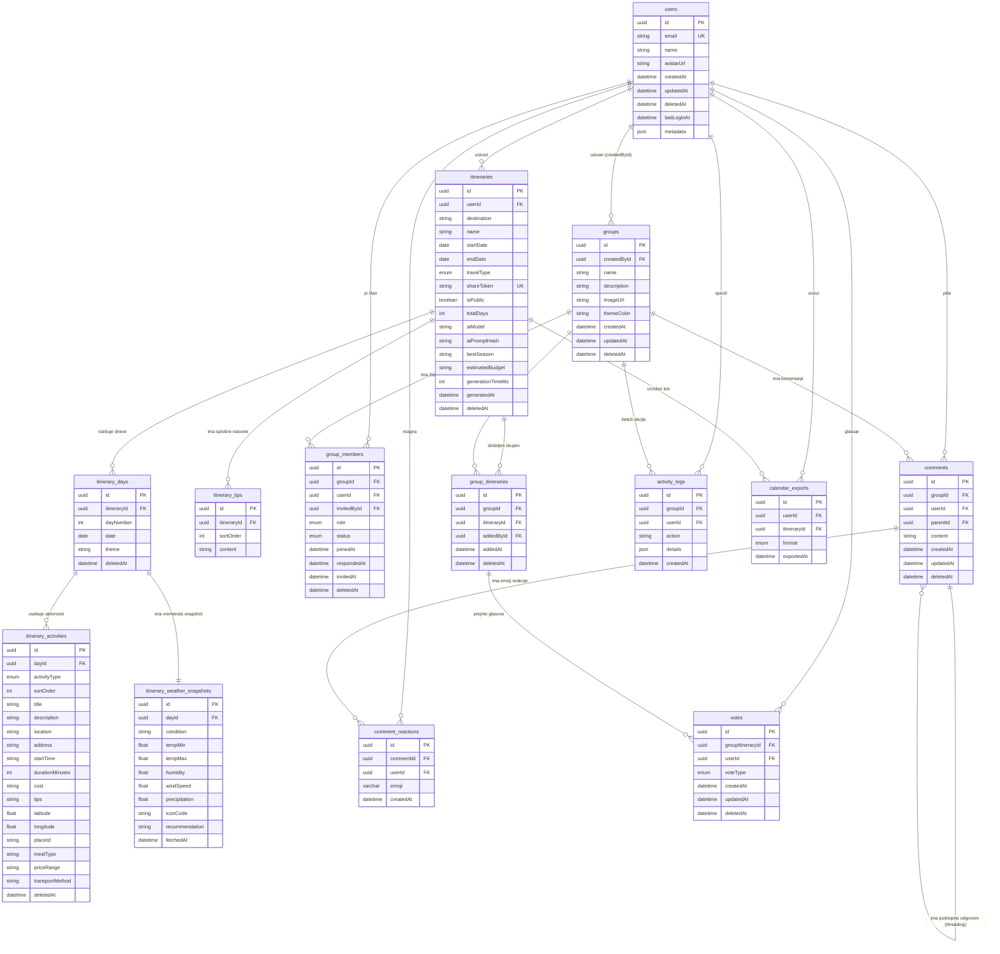
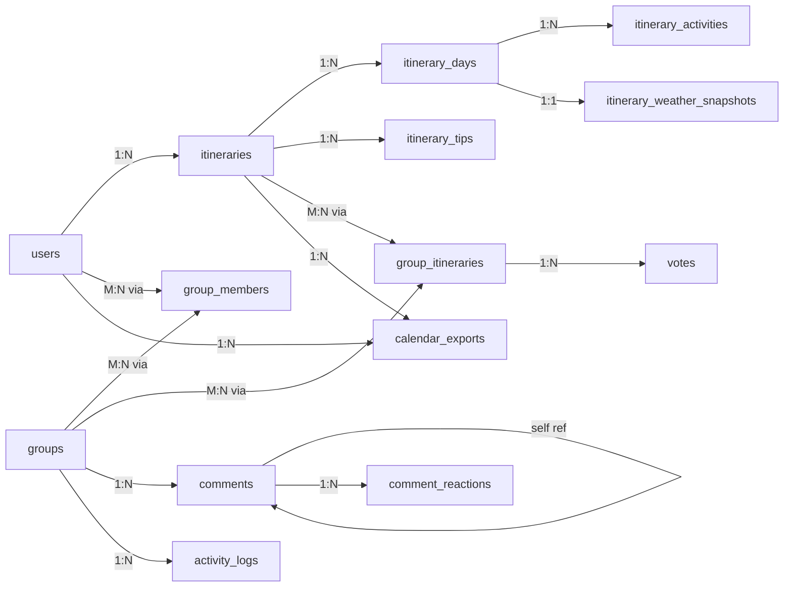

# Podatkovni model — Routiq

← [Nazaj na README](../README.md)

---

## Kazalo

1. [Pregled podatkovne baze](#1-pregled-podatkovne-baze)
2. [ER diagram](#2-er-diagram)
3. [Opis tabel](#3-opis-tabel)
4. [Enumeracije](#4-enumeracije)
5. [Relacije](#5-relacije)
6. [Soft delete](#6-soft-delete)
7. [Indeksi](#7-indeksi)
8. [Migracije](#8-migracije)

---

## 1. Pregled podatkovne baze

| Kategorija | Vrednost |
|---|---|
| Sistem | PostgreSQL 15 |
| Hosting | Supabase (managed + pgbouncer) |
| ORM | Prisma |
| Shema | `backend/prisma/schema.prisma` |
| Skupaj tabel | 14 |
| Primary key tip | UUID (Supabase kompatibilno) |
| Soft delete | Vse entitete imajo `deletedAt` polje |

**Zakaj UUID namesto auto-increment int?**  
Supabase generira UUID za users (`id` je tipa `uuid` direktno iz Supabase Auth). Za konsistentnost so vsi PKji UUID. UUIDs so varnejši (ne moremo ugibati ID-jev) in delujejo brez centraliziranega zaporedja.

---

## 2. ER diagram





---

## 3. Opis tabel

### `users`

Uporabniški profili — sinhroniziran iz Supabase Auth ob vsakem loginu (`upsertUser`).

| Polje | Tip | Opis |
|---|---|---|
| `id` | UUID PK | Enak kot Supabase Auth `user.id` |
| `email` | String UNIQUE | E-poštni naslov |
| `name` | String | Prikazno ime |
| `avatarUrl` | String? | URL do profilne slike |
| `lastLoginAt` | DateTime? | Čas zadnjega logina |
| `metadata` | Json | Nastavitve: tema, jezik, notifikacije |
| `deletedAt` | DateTime? | Soft delete — račun je deaktiviran |

### `itineraries`

Jedro aplikacije — shranjeni AI-generirani potovalni načrti.

| Polje | Tip | Opis |
|---|---|---|
| `userId` | UUID FK | Lastnik itinerarja |
| `destination` | String | Destinacija (npr. "Rim, Italija") |
| `name` | String? | Ime itinerarja (opcijsko) |
| `startDate` / `endDate` | Date | Datum potovanja (brez časa) |
| `travelType` | TravelType | Tip potovanja |
| `shareToken` | String? UNIQUE | Token za javni ogled brez prijave |
| `isPublic` | Boolean | Ali je dostopen prek shareToken |
| `totalDays` | Int | Število dni potovanja |
| `aiModel` | String? | Gemini model ki je generiral (za debugging) |
| `aiPromptHash` | String? | Hash prompta (zaznavanje dupliciranja) |
| `bestSeason` | String? | AI priporočena sezona za destinacijo |
| `estimatedBudget` | String? | AI ocena proračuna |
| `generationTimeMs` | Int? | Čas generiranja v ms (performance tracking) |

### `itinerary_days`

En dan potovalnega načrta.

| Polje | Tip | Opis |
|---|---|---|
| `itineraryId` | UUID FK | Matični itinerar |
| `dayNumber` | Int | Zaporedna številka dneva (1-based) |
| `date` | Date | Dejanski datum |
| `theme` | String? | AI-generirani opis tematike dneva |

**Unique constraint:** `(itineraryId, dayNumber)` — dva dneva z enako številko v istem itinerarju nista mogoča.

### `itinerary_activities`

Posamezna aktivnost v dnevu (atrakcija, obrok, prevoz...).

| Polje | Tip | Opis |
|---|---|---|
| `activityType` | ActivityType | Tip: ATTRACTION, MEAL, TRANSPORT, FREE_TIME, ACCOMMODATION |
| `sortOrder` | Int | Vrstni red v dnevu (za drag & drop) |
| `title` | String | Ime aktivnosti |
| `startTime` | String? | Čas začetka ("09:00") |
| `durationMinutes` | Int? | Trajanje v minutah |
| `latitude` / `longitude` | Float? | Koordinate za Google Maps marker |
| `placeId` | String? | Google Places ID za additional data |
| `mealType` | String? | Za MEAL: "zajtrk", "kosilo", "večerja" |
| `transportMethod` | String? | Za TRANSPORT: "avto", "pešačenje"... |

### `itinerary_weather_snapshots`

Vremenski snapshot za vsak dan — pridobljen iz Google Weather API ob generiranju.

| Polje | Tip | Opis |
|---|---|---|
| `dayId` | UUID FK UNIQUE | En snapshot na dan |
| `condition` | String | Opis vremena ("Partly Cloudy") |
| `tempMin` / `tempMax` | Float | Temperature v °C |
| `iconCode` | String? | Koda ikone za UI prikaz |
| `recommendation` | String? | AI komentar o vplivu vremena |

### `groups`

Skupinska potovalna skupnost.

| Polje | Tip | Opis |
|---|---|---|
| `createdById` | UUID FK | Ustvarjalec — avtomatsko dobi OWNER vlogo |
| `name` | String | Ime skupin |
| `imageUrl` | String? | Cover slika skupin |
| `themeColor` | String? | Hex barva za UI personalizacijo |

### `group_members`

M:N relacija med `groups` in `users` z vlogo in statusom povabila.

| Polje | Tip | Opis |
|---|---|---|
| `role` | GroupRole | OWNER, ADMIN, MODERATOR, MEMBER |
| `status` | InvitationStatus | PENDING, ACCEPTED, DECLINED, EXPIRED, CANCELLED |
| `invitedById` | UUID? FK | Kdo je povabil tega člana |
| `invitedAt` | DateTime? | Čas pošiljanja povabila |
| `respondedAt` | DateTime? | Čas sprejema/zavrnitve |

**Unique constraint:** `(groupId, userId)` — en user je v skupini samo enkrat.

### `comments`

Komentarji v skupinskem klepetu z threading (podrejenimi odgovori).

| Polje | Tip | Opis |
|---|---|---|
| `groupId` | UUID FK | Skupin klepet |
| `parentId` | UUID? FK | Samoreferencirajoča relacija — za threading odgovorov |

**Samoreferencirajoča relacija:** `Comment → parent Comment → parent Comment...` — omogoča neomejeno globino odgovorov.

### `votes`

Glasovanje za itinerarje znotraj skupin.

| Polje | Tip | Opis |
|---|---|---|
| `groupItineraryId` | UUID FK | Na kateri itinerar glasujemo |
| `voteType` | VoteType | UPVOTE ali DOWNVOTE |

**Unique constraint:** `(groupItineraryId, userId)` — en glas na uporabnika na itinerar. Upsert zamenja prejšnji glas.

### `activity_logs`

Revizijska sled akcij v skupini.

| Polje | Tip | Opis |
|---|---|---|
| `action` | String | Npr. "GROUP_CREATED", "MEMBER_INVITED", "ITINERARY_ADDED" |
| `details` | Json? | Kontekstualni podatki akcije |

### `calendar_exports`

Beleži kdaj je kdo izvozil itinerar v kateri format.

---

## 4. Enumeracije

### `TravelType` — tip potovanja

| Vrednost | Opis |
|---|---|
| `CULTURAL` | Kulturno (muzeji, galerije, zgodovinska mesta) |
| `GASTRONOMIC` | Gastronomsko (restavracije, lokalna hrana, trgi) |
| `NATURE` | Naravo (parki, planinarjenje, krajina) |
| `ADVENTURE` | Pustolovsko (šport, ekstremne aktivnosti) |
| `RELAX` | Sprostitev (plaže, spa, počitek) |

### `GroupRole` — vloga v skupini

Hierarhija: `OWNER > ADMIN > MODERATOR > MEMBER`

| Vrednost | Pravice |
|---|---|
| `OWNER` | Polna kontrola, edini ki sme brisati skupino |
| `ADMIN` | Upravlja člane (povabi, odstrani MEMBER/MODERATOR) |
| `MODERATOR` | Dodaten nivo (rezerviran za prihodnje funkcionalnosti) |
| `MEMBER` | Bere vsebino, glasuje, komentira |

### `InvitationStatus` — status povabila

| Vrednost | Opis |
|---|---|
| `PENDING` | Čaka na odgovor |
| `ACCEPTED` | Sprejeto — član je aktiven |
| `DECLINED` | Zavrnjeno (re-invite je možen) |
| `EXPIRED` | Povabilo je poteklo (za prihodnji cron) |
| `CANCELLED` | Prekinjeno s strani vabitelja |

### `VoteType`

`UPVOTE` ali `DOWNVOTE`

### `ActivityType` — tip aktivnosti

`ATTRACTION`, `MEAL`, `TRANSPORT`, `FREE_TIME`, `ACCOMMODATION`

### `ExportFormat`

`ICS`, `PDF`

---

## 5. Relacije



---

## 6. Soft delete

Vse entitete (razen `itinerary_weather_snapshots`, `itinerary_tips`, `calendar_exports`, `comment_reactions`) imajo `deletedAt DateTime?` polje.

**Zakaj soft delete?**
- GDPR compliance — podatki so "izbrisani" z vidika uporabnika, a ohranimo revizijsko sled
- Preprečuje osirotele relacije (cascade hard delete bi odstranil povezane podatke)
- Omogoča "undo" operacije

**Implementacija:** Prisma middleware v `prisma.service.ts` samodejno dodaja `WHERE deletedAt IS NULL` filter na vse `find*` operacije. Izjema: specifični klici kjer je potreben dostop do "izbrisanih" zapisov (npr. re-invite DECLINED člana).

```typescript
// Primer: upsert za re-invite (dostop do DECLINED zapisa)
await this.prisma.groupMember.upsert({
  where: { groupId_userId: { groupId, userId } },
  create: { role, status: 'PENDING', ... },
  update: { status: 'PENDING', deletedAt: null, ... },
})
```

---

## 7. Indeksi

Prisma shema definira indekse za najpogostejše query patterns:

| Tabela | Indeks | Razlog |
|---|---|---|
| `users` | `email` | Login lookup |
| `users` | `createdAt` | Sortiranje po datumu registracije |
| `itineraries` | `userId` | Moji itinerarji |
| `itineraries` | `destination` | Iskanje po destinaciji |
| `itineraries` | `(startDate, endDate)` | Filtriranje po datumu |
| `itinerary_days` | `itineraryId` | Dnevi itinerarja |
| `itinerary_activities` | `dayId` | Aktivnosti dneva |
| `group_members` | `groupId`, `userId`, `status` | Membership lookup |
| `group_itineraries` | `groupId`, `itineraryId` | Itinerarji skupin |
| `votes` | `groupItineraryId`, `userId` | Glasovi na itinerar |
| `comments` | `groupId`, `userId`, `parentId` | Komentarji skupin + threading |
| `activity_logs` | `groupId`, `userId`, `createdAt` | Activity feed |

---

## 8. Migracije

Vsaka sprememba sheme poteka prek Prisma migrations:

```bash
# 1. Uredi prisma/schema.prisma
# 2. Ustvari migracijo
npx prisma migrate dev --name kratki-opis-spremembe
# 3. Prisma generira SQL migracijo in jo aplicira
# 4. Commitaj skupaj s shemo
git add prisma/schema.prisma prisma/migrations/
git commit -m "chore: add share token to itinerary"
```

**Migracije so del repota.** Ko drug član naredi `git pull` in zažene `npx prisma migrate deploy`, dobi enako stanje baze.

**Nikoli ne editamo migration SQL datotek ročno** — spremembe delamo samo v `schema.prisma`.

```bash
npx prisma migrate dev      # Development (ustvari + aplicira)
npx prisma migrate deploy   # Produkcija / CI (samo aplicira obstoječe)
npx prisma generate         # Regenerira TypeScript client
npx prisma studio           # Vizualni brskalnik baze
npx prisma db seed          # Testni podatki
```
