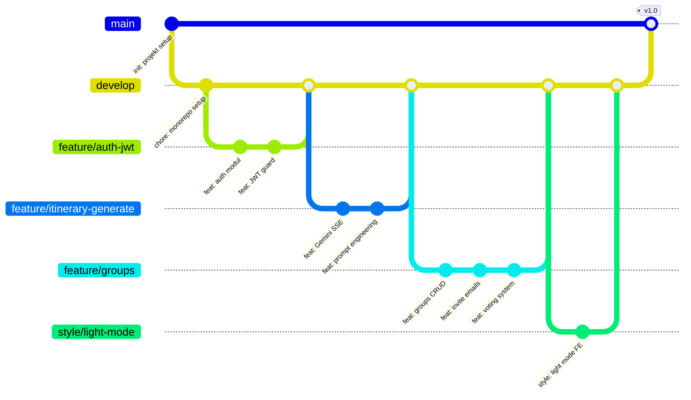

# Vodenje projekta — Routiq

← [Nazaj na README](../README.md)

---

## Kazalo

1. [Git workflow — branch model](#1-git-workflow--branch-model)
2. [Commit konvencija](#2-commit-konvencija)
3. [Pull Request proces](#3-pull-request-proces)
4. [Razdelitev dela po iteracijah](#4-razdelitev-dela-po-iteracijah)
5. [Ekipa in vloge](#5-ekipa-in-vloge)

---

## 1. Git workflow — branch model

```
main          ← Produkcija. Samo stabilen, testiran kod.
develop       ← Aktivni razvoj. Sem gre vse.
  └── feature/auth-jwt
  └── feature/itinerary-generate
  └── feature/groups
  └── feature/google-maps
  └── feature/exporting
  └── feature/editing
  └── style/light-mode-support
  └── fix/weather-cache
  └── chore/prisma-setup
```

**Pravila:**
- Vsi delamo na **feature branchih** ki izhajajo iz `develop`
- `main` se merga samo ko je iteracija **stabilna in testirana**
- Branch se briše po mergeu
- Direkten push na `main` ali `develop` ni dovoljen (samo prek PR)

**Poimenovanje branchov:**
```
feature/<kratki-opis>   → feature/groups-invite-system
fix/<kratki-opis>       → fix/group-itinerary-access
style/<kratki-opis>     → style/light-mode-support
chore/<kratki-opis>     → chore/pin-axios-1.14.0
docs/<kratki-opis>      → docs/update-backend-architecture
test/<kratki-opis>      → test/itinerary-service-unit-tests
```

**Git flow vizualizacija:**



---

## 2. Commit konvencija

Format: `<tip>: <kratki opis>` (Conventional Commits standard)

Opis je v **angleščini**, kratek, brez pike na koncu.

| Tip | Kdaj | Primer |
|---|---|---|
| `feat` | Nova funkcionalnost | `feat: add Gemini SSE streaming endpoint` |
| `fix` | Bug fix | `fix: cascade group removal on itinerary delete` |
| `refactor` | Prestrukturiranje brez spremembe funkcionalnosti | `refactor: extract token refresh logic to hook` |
| `style` | Samo styling / CSS spremembe | `style: add dark mode to AddItineraryModal` |
| `test` | Testi | `test: align groups service tests with soft-delete` |
| `chore` | Setup, dependencies, tooling | `chore: pin axios to 1.14.0` |
| `docs` | Dokumentacija | `docs: update BACKEND_ARCHITECTURE.md` |

**Primeri iz tega projekta:**
```
feat: add emoji reactions, reply threading, and emoji picker to group chat
feat: full itinerary editing — drag & drop, add/edit/delete activities
fix: group members can now access shared itineraries + deleted ones hidden
feat: redesign itinerary page with dark hero, Wikipedia cover photo, and timeline activities
style: replace native date picker with custom calendar popup in planner
chore: modernize unit tests, align with active service design
```

---

## 3. Pull Request proces

### PR pravila

1. PR odpreš ko je feature **funkcionalno končan**
2. PR naslov sledi commit konvenciji
3. PR opis vsebuje: kaj je narejeno + kako preveriti
4. Drugi član ekipe **pregleda in aprovira** pred mergem
5. Avtor sam merga po approvu, samo v `develop`
6. Branch se briše takoj po mergeu

### PR predloga — Frontend

```markdown
## Kaj je narejeno
Kratki opis feature-a ali fixa.

## Kako preveriti
1. Pojdi na /planner
2. Vnesi destinacijo in klikni "Generiraj"
3. Preveri da se AI tekst streama po dnevih

## Screenshots
[priloži screenshot za UI spremembe]

## Checklist
- [ ] Koda sledi pravilom iz docs/coding-standards.md
- [ ] Testirano na mobilni in desktop
- [ ] Ni `console.log` ostankov
- [ ] TypeScript brez `any`
```

### PR predloga — Backend

```markdown
## Kaj je narejeno
Kratki opis feature-a.

## Endpointi
- POST /groups/:id/invite
- POST /groups/:id/accept

## Kako preveriti
1. Zaženi `npm run start:dev`
2. Povabi člana: POST /api/groups/:id/invite { email: "test@test.com" }
3. Preveri da prispe e-pošta (Resend dashboard)

## Checklist
- [ ] DTO validacija za vse nove endpointe
- [ ] Ni `console.log` ostankov
- [ ] TypeScript brez `any`
- [ ] Unit testi za novo logiko
```

---

## 4. Razdelitev dela po iteracijah

| Iteracija | Namen | Status |
|---|---|---|
| **1** | Projekt setup, avtentikacija (FE + BE), UI primitivi | ✅ Končano |
| **2** | AI generiranje (SSE), Planner wizard, Google Maps | ✅ Končano |
| **3** | Urejanje itinerarja, PDF/ICS izvoz, Skupinska potovanja | ✅ Končano |
| **4** | Emoji klepet, drag & drop, light mode, Wikipedia slike | ✅ Končano |
| **5** | Unit testi, CI/CD pipeline, deploy, dokumentacija | ✅ Končano |

### Iteracija 1 — Setup & Auth

| Član | Frontend | Backend |
|---|---|---|
| **Jan** | Vite setup, Tailwind, ESLint/Prettier, axios instanca, router | NestJS setup, Prisma/Supabase konfiguracija, seed |
| **Klemen** | UI primitivi: Button, Input, Modal, Spinner, Badge, Card, Skeleton. Layout: AppShell, Sidebar, Topbar | Auth: JWT guard, Supabase integracija, `/auth/me` endpoint |
| **Mojca** | Auth feature: LoginPage, RegisterPage, Google OAuth gumb, AuthContext, ProtectedRoute, Zod forme | Itinerary modul osnova: DTO, Prisma model, basic CRUD. Gemini service setup. |

### Iteracija 2 — AI generiranje, Maps, Weather

| Član | Frontend | Backend |
|---|---|---|
| **Jan** | Planner wizard (večstopenjski form): destinacija, datumi, tip. AI SSE streaming prikaz, ProgressBar | `/itinerary/generate` SSE endpoint, promptni inženiering |
| **Klemen** | Google Maps integracija: GoogleMapsProvider, ItineraryMap, AttractionMarker | `attractions/` modul: Google Places proxy, integracija v prompt |
| **Mojca** | Itinerary stran: prikaz po dnevih, DayCard, AttractionCard, WeatherBadge | `weather/` modul: Google Weather API proxy + 1h cache. Google OAuth |

### Iteracija 3 — Export, urejanje, skupin

| Član | Frontend | Backend |
|---|---|---|
| **Jan** | PDF izvoz (@react-pdf/renderer), ICS izvoz (klic backend) | `export/` modul: .ics generiranje. Share token za itinerar |
| **Klemen** | Urejanje itinerarja: swap/dodaj/odstrani atrakcijo | Urejanje aktivnosti endpointi |
| **Mojca** | Groups feature: GroupsPage, GroupDetailPage, CreateGroupModal, InviteMemberForm | `groups/` modul: CRUD skupin, invite sistem, komentarji, glasovanje |

### Iteracija 4 — Polish & features

| Član | Naloge |
|---|---|
| **Jan** | Wikipedia cover fotografije za destinacije, TripsPage pregled |
| **Klemen** | Drag & drop razporejanje aktivnosti (@dnd-kit), aktivnostni edit modal |
| **Mojca** | Emoji reakcije na komentarje, reply threading, EmojiPickerPanel. Light/dark mode. |

### Iteracija 5 — Kakovost & deploy

| Član | Naloge |
|---|---|
| **Jan** | CI/CD pipeline (GitHub Actions), Vercel deploy, `vercel.json` konfiguracija |
| **Klemen** | Unit testi: itinerary controller/service, auth guard, dekoratorji |
| **Mojca** | Unit testi: groups controller/service, users service. Varnostni pregled. |

---

## 5. Ekipa in vloge

| Član | Primarna področja |
|---|---|
| **Jan Ančevski** | Planner wizard, AI SSE streaming UI, PDF/ICS izvoz, Google Maps integracija, CI/CD in deploy, Wikipedia integracija |
| **Klemen Novak** | UI component library (Button, Modal, Input...), layout sistem, urejanje itinerarja (drag & drop), backend unit testi |
| **Mojca Marin** | Auth feature (FE), skupinska potovanja (FE + BE), weather modul (BE), users modul (BE), emoji klepet, light mode |

Skupno: **~81 commitov** od treh članov ekipe.
