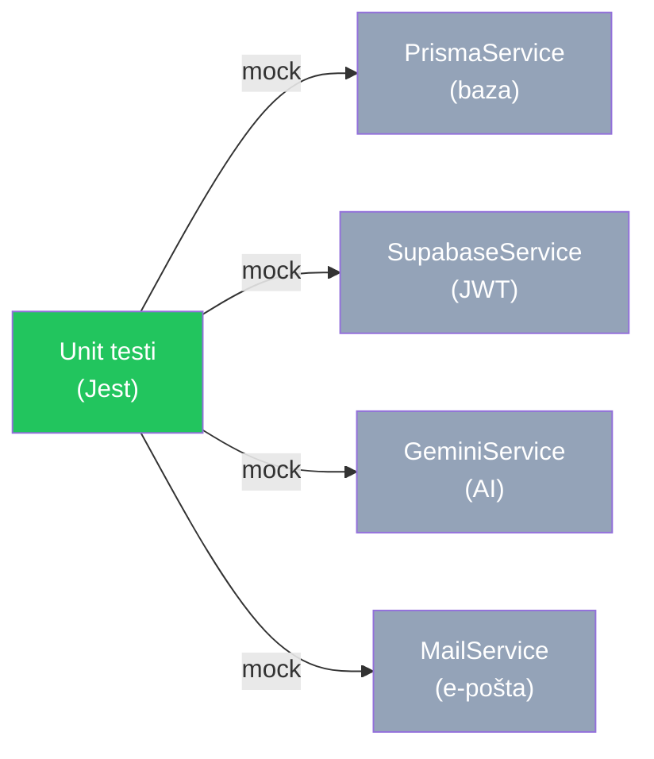

# Testiranje — Routiq

← [Nazaj na README](../README.md)

---

## Kazalo

1. [Testna strategija](#1-testna-strategija)
2. [Kako zagnati teste](#2-kako-zagnati-teste)
3. [Pregled testnih datotek](#3-pregled-testnih-datotek)
4. [JwtAuthGuard testi](#4-jwtauthguard-testi)
5. [Auth dekoratorji](#5-auth-dekoratorji)
6. [Itinerary Controller testi](#6-itinerary-controller-testi)
7. [Itinerary Service testi](#7-itinerary-service-testi)
8. [ItineraryGeneration Service testi](#8-itinerarygeneration-service-testi)
9. [Users Service testi](#9-users-service-testi)
10. [Groups Controller testi](#10-groups-controller-testi)
11. [Groups Service testi](#11-groups-service-testi)
12. [Principi pisanja testov](#12-principi-pisanja-testov)

---

## 1. Testna strategija

Vsi testi so **unit testi** — nobena zunanja odvisnost (baza, API, omrežje) ni dejanska. Vsaka zunanja storitev je zamenjana z Jest mock objektom.



**Zakaj samo unit testi (brez integration/E2E)?**
- Hitri: tečejo v sekundah, ne minutah
- Determinizmi: niso odvisni od zunanjih storitev ali stanja baze
- Odkrijejo regresije takoj ob save-u (`--watch` mode)
- Manjša kompleksnost vzpostavitve (ni potrebna testna baza)

**Omejitev:** Unit testi ne odkrijejo napak na mejah med sistemi (npr. SQL query napake, API format spremembe). Za to bi bili potrebni integration testi.

---

## 2. Kako zagnati teste

```bash
cd backend

# Zaženi vse teste enkrat
npx jest

# Watch mode — retestira ob vsaki spremembi datoteke
npx jest --watch

# Samo ena spec datoteka
npx jest itinerary.service
npx jest jwt-auth.guard
npx jest groups.service

# Poroča o pokritosti kode
npx jest --coverage

# Verbose output (pokaže vsak test)
npx jest --verbose
```

> Testi niso vezani na git push — tečejo samo ročno ali v CI pipeline-u.

---

## 3. Pregled testnih datotek

```
backend/src/
├── common/
│   ├── guards/
│   │   └── jwt-auth.guard.spec.ts           # JwtAuthGuard — 8 skupin testov
│   └── decorators/
│       └── auth-decorators.spec.ts          # @Public() in @CurrentUser()
├── itinerary/
│   ├── itinerary.controller.spec.ts         # HTTP routing layer — 7 endpointov
│   ├── itinerary.service.spec.ts            # Business logika — 9 skupin testov
│   └── itinerary-generation.service.spec.ts # AI mapiranje in persistenca
├── groups/
│   ├── groups.controller.spec.ts            # Groups routing — 14 endpointov
│   └── groups.service.spec.ts               # Permission hierarhija + transakcije
└── users/
    └── users.service.spec.ts                # Profil, nastavitve, avatar, brisanje
```

---

## 4. JwtAuthGuard testi

**Datoteka:** `common/guards/jwt-auth.guard.spec.ts`

Testira globalni guard ki varuje vse (ne-javne) endpointe.

**Posebnost mock-a:** `passport-jwt` je mockiran *pred* importom guard-a z `jest.mock(...)`. To je potrebno ker guard kliče `ExtractJwt.fromAuthHeaderAsBearerToken()` ob zagonu — brez mock-a bi resnična implementacija tiho vrnila `null`.

| Testni scenarij | Pričakovan rezultat |
|---|---|
| `@Public()` ruta | Vrne `true` brez klica Supabase |
| Manjkajoč token (null/"") | `UnauthorizedException('Missing bearer token')` |
| Supabase nedostopen (getClient = null) | `UnauthorizedException('Authentication service unavailable')` |
| Neveljaven/potekel token | `UnauthorizedException` z Supabase error sporočilom |
| Supabase vrne null user brez error | `UnauthorizedException` s fallback sporočilom |
| Veljaven token | `true`, `request.user` nastavljen, `upsertUser` poklican |
| Anonimen user (brez emaila) | Email: `<id>@anonymous.routiq.local`, `upsertUser` z `name: undefined` |
| `upsertUser` pade | Guard vrne `true`, napaka je swallowana (ne sesuje request) |

---

## 5. Auth dekoratorji

**Datoteka:** `common/decorators/auth-decorators.spec.ts`

### `@Public()`

| Test | Kar preverja |
|---|---|
| Dekoriran handler | `Reflect.getMetadata('isPublic', handler)` vrne `true` |
| Nedekoriran handler | `Reflect.getMetadata('isPublic', handler)` vrne `undefined` |
| Vrednost ključa | `IS_PUBLIC_KEY === "isPublic"` (mora ustrezati kar guard bere) |

### `@CurrentUser()`

Dekorator factory: `return data ? user[data] : user`

| Test | Kar preverja |
|---|---|
| Brez argumenta | Vrne celoten JwtPayload objekt |
| Z argumentom (`'sub'`, `'email'`, `'role'`) | Vrne samo to polje |
| Neznano polje | Vrne `undefined` brez napake |
| `request.user` je undefined | Vrne `undefined` brez napake |

---

## 6. Itinerary Controller testi

**Datoteka:** `itinerary/itinerary.controller.spec.ts`

`ItineraryService` je popolnoma mockiran — controller testi verificirajo samo routing in parameter ekstrakcijo.

| Endpoint | Testni scenariji |
|---|---|
| `POST /generate` | SSE chunki so oviti v `{ data: ... }`, stream napake se propagirajo |
| `GET /` | Privzeti page=1, limit=10 ob odsotnih params; string params → int |
| `GET /:id` | Posreduje `id` in `user.sub`; propagira `NotFoundException` |
| `PATCH /:id` | Posreduje `id`, `user.sub` in DTO; propagira `NotFoundException` |
| `DELETE /:id` | Vrne success sporočilo; propagira `NotFoundException` |
| `POST /:id/share` | Vrne share token |
| `GET /shared/:token` | Kliče `getItineraryByShareToken` (brez user id); propagira `NotFoundException` |

---

## 7. Itinerary Service testi

**Datoteka:** `itinerary/itinerary.service.spec.ts`

Mockirani: `PrismaService`, `GeminiService`, `ItineraryGenerationService`.

### `getUserItineraries`
- Paginacija: `skip = (page - 1) * limit`
- Query scopiran na `userId` prijavljenega userja

### `getItineraryById`
- Happy path, `NotFoundException` za manjkajoč zapis
- **Posebni primer:** Ko je `userId` falsy (share-token pot), `userId` ključ mora biti **v celoti odsoten** iz Prisma `where` klavzule (ne `where: { userId: undefined }`)

### `getItineraryByShareToken`
- Lookup po `shareToken`; `NotFoundException` za neznan token

### `updateItinerary`
- Lastništvo preverjanje pred posodobitvijo
- **Dokumentirana omejitev:** `travelType` v DTO-ju se NE zapiše v bazo (service `update` samo spreada `destination`, `startDate`, `endDate`)

### `deleteItinerary`
- Lastništvo preverjanje, soft delete (`deletedAt = now`)
- `delete` se ne pokliče za zapis ki ne pripada userju

### `generateShareToken`
- Nov naključni token se generira in shrani (ko ni obstoječega)
- Obstoječi token se vrne brez klica `update`
- `NotFoundException` za zapis ki ne pripada userju

### `generateStream`

Najbolj kompleksna metoda — veriga: priprava podatkov → Gemini SSE → Prisma transakcija.

**Mock za ordering eventov:**
```typescript
// delay(0) in delay(1) sta potrebna ker switchMap prekliče prejšnji observable
concat(
  of(progressEvent).pipe(delay(0)),
  of(completeEvent).pipe(delay(1))
)
```

| Test | Kar preverja |
|---|---|
| Ordering eventov | Progress eventi pridejo pred complete |
| Complete payload | `complete` event vsebuje `itineraryId` iz DB |
| Prep klic | `prepareGenerationData` poklican z ustreznimi parametri |
| Persist tips | `itineraryTip.create` poklican enkrat za vsak tip |
| Prep neuspešen | Stream emitira `{ type: 'error' }`, ne vrže na subscriber |
| Gemini neuspešen | Enako — error event, ne throw |

### Private helper metode

Dostop prek type-safe casting (ne `as any`):
```typescript
(service as unknown as { methodName: ReturnType }).methodName()
```

| Helper | Test |
|---|---|
| `generateRandomToken` | Vrne neprazen string; dve zaporedni klic vrneta različne vrednosti |
| `hashString` | Isti input = isti hash; različna inputa = različna hasha |

---

## 8. ItineraryGeneration Service testi

**Datoteka:** `itinerary/itinerary-generation.service.spec.ts`

Mockirani: `PrismaService`, `AttractionsService`, `WeatherService`, `AppConfigService`.

| Metoda | Kaj se testira |
|---|---|
| `prepareGenerationData` | Vzporedni fetch weather + attractions; klic prompt builderja |
| `persistGeneratedItinerary` | Prisma transakcija; fallback za manjkajoče summaries/tips |
| `mapSingleDay` | Mapiranje AI sheme → DB shema; konverzija duration string → minute; ATTRACTION vs MEAL tip |
| `mapDaysForNestedWrite` | Iteracija in mapiranje več dni |

---

## 9. Users Service testi

**Datoteka:** `users/users.service.spec.ts`

Mockirani: `PrismaService`, `SupabaseService`.

| Skupina | Testni scenariji |
|---|---|
| `upsertUser` | Ustvari/posodobi user; privzeto ime/avatar; posodobi `lastLoginAt` |
| `updateProfile` | `NotFoundException` za manjkajočega userja; `ConflictException` za duplikat email; uspešna posodobitev |
| `getSettings` / `updateSettings` | Merge privzetih nastavitev s shranjenimi; persist posodobitev |
| `uploadAvatarFile` | Manjkajoč storage (error); upload napaka; persist javnega URL |
| `deleteAccount` | Soft delete; Supabase admin delete (ko je dostopen) |

---

## 10. Groups Controller testi

**Datoteka:** `groups/groups.controller.spec.ts`

`GroupsService` je popolnoma mockiran.

| Endpoint | Testni scenariji |
|---|---|
| `getUserGroups` | Delegira na service z `user.sub`; prazna lista |
| `getPendingInvitations` | Pridobi povabila kličočega userja |
| `getGroupById` | Happy path; `ForbiddenException`; `NotFoundException` |
| `getGroupActivityLog` | Privzeti limit 50; parsiranje custom limit query parametra |
| `createGroup` | Posreduje DTO in `user.sub` |
| `deleteGroup` | Vrne success; `ForbiddenException` za non-owner |
| `inviteMember` | Vrne membership; `BadRequestException` duplikat; `NotFoundException` neznan email |
| `acceptInvitation` / `declineInvitation` | Uspešni accept/decline; `NotFoundException` brez pending povabila |
| `removeMember` | Delegira; `ForbiddenException` za nezadostno vlogo |
| `updateMemberRole` | Delegira; `BadRequestException` za self-role spremembo |
| `addItineraryToGroup` | Delegira; `BadRequestException` za duplikat |
| `getComments` / `addComment` | Kreiranje in pridobivanje; threading (parentId); `NotFoundException` |
| `getVotes` / `voteForItinerary` | UPVOTE/DOWNVOTE; `ForbiddenException` za non-member |

---

## 11. Groups Service testi

**Datoteka:** `groups/groups.service.spec.ts`

Mockirani: `PrismaService`, `MailService`.

| Področje | Testni scenariji |
|---|---|
| **Query & kreiranje** | `getUserGroups` obogati z member/itinerary štetjem; `createGroup` nastavi OWNER, logira `GROUP_CREATED` |
| **Brisanje** | Samo OWNER; `ForbiddenException` za vse ostale vloge |
| **Povabila in vloge** | `inviteMember`: role check, PENDING, re-invite za DECLINED; `acceptInvitation`: timestamp-i |
| **Upravljanje členov** | `removeMember`: rank hierarhija, blokira self-remove edinega OWNER; `updateMemberRole`: blokira self-update |
| **Skupinski itinerarji** | `addItineraryToGroup`: check membership + ownership + duplikat; `voteForItinerary`: upsert, privzet tip |
| **Komentarji** | `addComment`: top-level + threading (validiraj parent); `getComments`: s replies |
| **Activity log resilience** | Padec logging operacije NE sesuje celotne transakcije |

### Ključni test: Activity log resilience

```typescript
it('should not throw if activity log creation fails', async () => {
  mockPrisma.activityLog.create.mockRejectedValue(new Error('DB error'))

  // Kljub padcu logiranja — operacija uspe
  await expect(service.createGroup(dto, userId)).resolves.toBeDefined()
})
```

---

## 12. Principi pisanja testov

### Nikoli `any` v testih

```typescript
// ❌ Napačno
(service as any).privateMethod()

// ✓ Pravilno — type-safe casting
(service as unknown as { privateMethod: () => string }).privateMethod()
```

### Mock samo kar je potrebno

```typescript
// ❌ Nepotrebno mockiranje
mockPrisma.user.findMany.mockResolvedValue([])
mockPrisma.itinerary.count.mockResolvedValue(0)
mockPrisma.group.findFirst.mockResolvedValue(null)

// ✓ Mock samo kar ta test dejansko pokliče
mockPrisma.itinerary.findMany.mockResolvedValue([fakeItinerary])
```

### Testi so dokumentacija

Dobro napisan test razloži pričakovano vedenje brez komentarjev:

```typescript
it('should throw NotFoundException when itinerary belongs to different user', async () => {
  mockPrisma.itinerary.findUnique.mockResolvedValue({
    ...fakeItinerary,
    userId: 'other-user-id',  // Ne pripada kličočemu userju
  })

  await expect(service.deleteItinerary('id', 'my-user-id'))
    .rejects.toThrow(NotFoundException)
})
```
